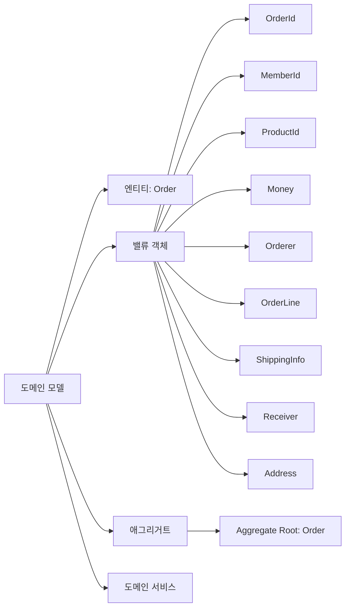
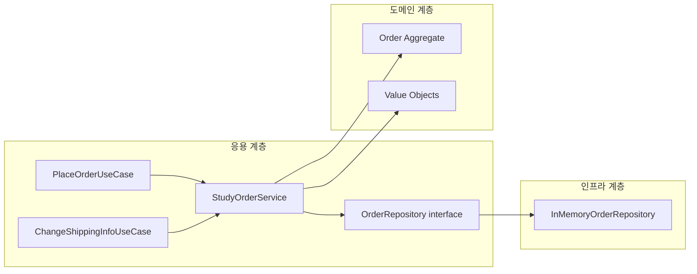
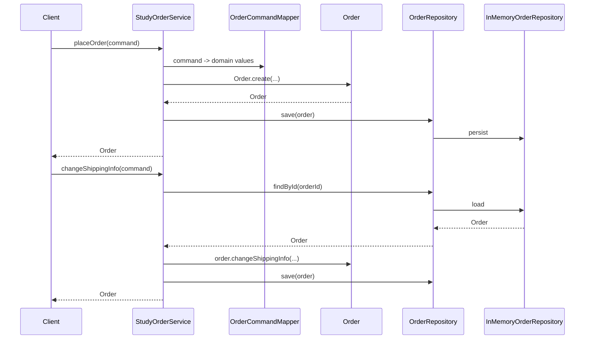
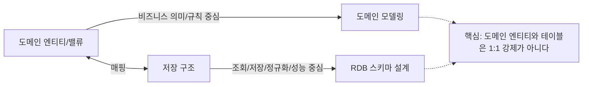
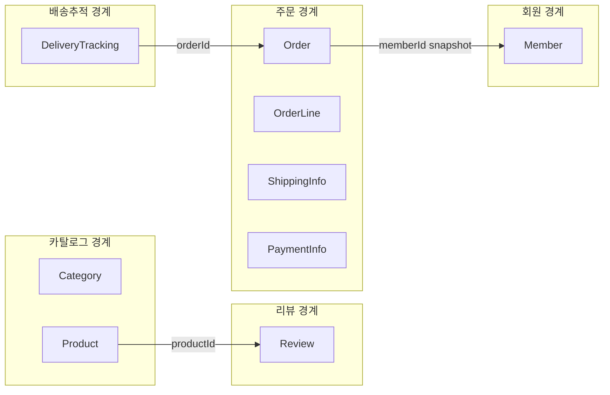
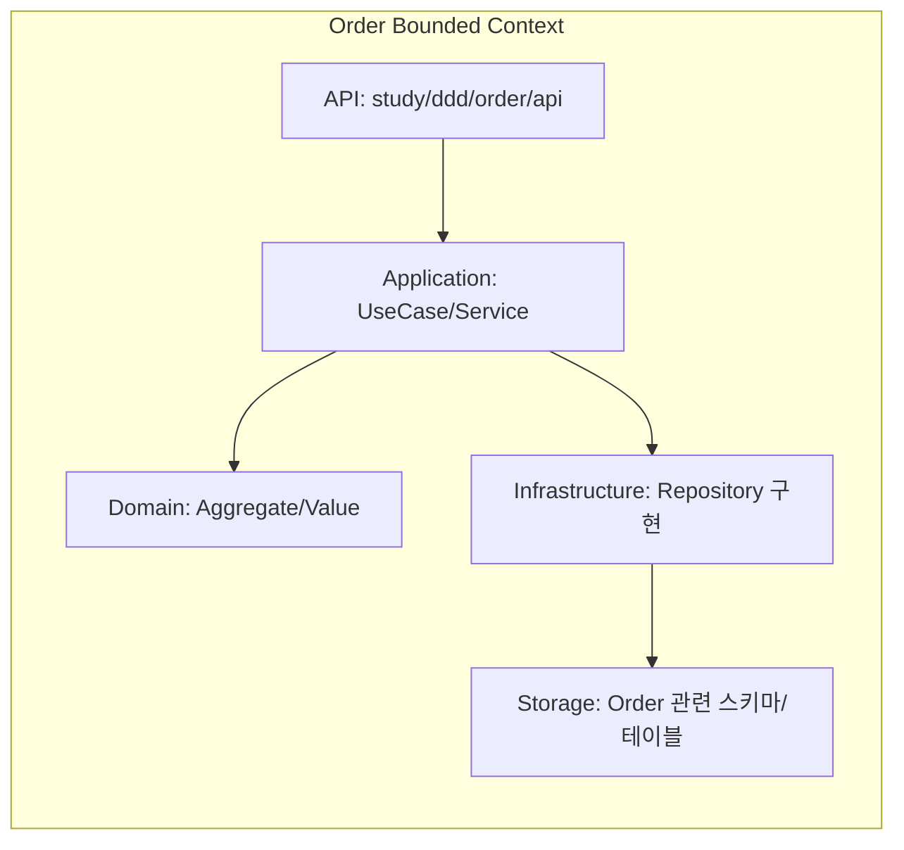

# DDD 계층 구조와 DIP 적용 실습 (주문 예제)

## 요약

이번 실습은 다음 관점을 코드에 녹이는 데 집중했다.

- 도메인 모델은 엔티티와 같은 개념이 아니다.
- 엔티티는 도메인 모델의 구성요소 중 하나다.
- 응용 계층은 유스케이스를 조율하고, 도메인 계층은 규칙을 책임진다.
- 인프라 계층은 저장/외부 연동 같은 구현 기술을 담당한다.
- DIP는 유지하되, 헥사고날 아키텍처 용어(`Port`, `Adapter`)는 사용하지 않는다.
- 도메인 구성요소로 분류/상품/리뷰/주문/결제/회원/배송 추적 모델을 함께 다룬다.

핵심은 "비즈니스 규칙을 DB 구조가 아니라 도메인 모델 중심으로 표현하는 것"이다.

## 사용법

1. 주문 생성

- `PlaceOrderUseCase.placeOrder(command)`를 호출한다.
- 응용 서비스는 커맨드를 도메인 객체로 변환하고 `Order.create(...)`를 호출한다.
- 생성 검증은 도메인 밸류 객체와 애그리거트가 처리한다.

2. 배송 정보 변경

- `ChangeShippingInfoUseCase.changeShippingInfo(command)`를 호출한다.
- 응용 서비스는 `OrderRepository`로 주문을 조회하고 `Order.changeShippingInfo(...)`를 호출한다.
- 취소된 주문 변경 금지 같은 규칙은 `Order`가 강제한다.

## 동작 방식

### 1) 도메인 모델과 엔티티 관계

### 2) 계층 책임 분리

### 3) 주문 처리 흐름

### 4) 도메인 엔티티와 저장 구조의 관계

### 5) 아키텍처 선택 기준

- 이 예제는 헥사고날 아키텍처를 채택하지 않는다.
- `Port`, `Adapter` 용어는 지양하고 `Repository interface/구현체` 용어로 단순화했다.
- 이유는 학습 단계에서 용어/구조 복잡도를 낮추고, 계층 책임과 도메인 규칙에 집중하기 위해서다.

### 6) 애그리거트 경계 판단 기준

- "A가 B를 가진다"는 표현만으로 같은 애그리거트라고 판단하지 않는다.
- 생성 시점, 변경 주기, 즉시 일관성 규칙이 다르면 애그리거트를 분리한다.
- 경계 간 참조는 객체 참조 대신 식별자 참조를 우선한다.

### 7) 트랜잭션 경계 원칙

- 트랜잭션 범위는 작을수록 좋다.
- 기본 원칙은 유스케이스 1개가 애그리거트 1개를 변경하도록 설계하는 것이다.
- 여러 애그리거트를 한 트랜잭션에서 함께 수정하면 락 보유 시간/충돌/성능 비용이 커질 수 있다.
- 본 예제도 응용 서비스 메서드 단위로 `@Transactional`을 두고, 애그리거트 루트 도메인 메서드만 호출하도록 구성했다.

### 8) 바운디드 컨텍스트 관점으로 본 주문 모듈

- 바운디드 컨텍스트는 도메인 모델만의 경계가 아니다.
- 주문 컨텍스트는 API, 응용 서비스, 도메인 모델, 인프라 구현, 저장 구조를 함께 포함하는 실행 단위다.
- 이 프로젝트의 `study/ddd/order` 패키지는 주문 유비쿼터스 언어가 일관되게 유지되는 하나의 경계로 본다.

- 같은 용어라도 컨텍스트가 다르면 의미가 달라질 수 있다.
  - 판매 컨텍스트의 상품: 판매 가능한 상품
  - 배송 컨텍스트의 상품: 배송 대상 품목
  - 정산 컨텍스트의 상품: 정산 기준 항목

### 9) Kotlin `@JvmInline value class`를 DDD에 쓰는 이유와 방법

- 왜 쓰는가
  - 식별자/점수 같은 도메인 값을 원시 타입(`String`, `Int`) 대신 의미 있는 타입으로 표현해 타입 안정성을 높인다.
  - `OrderId`, `MemberId`, `ProductId`를 서로 잘못 전달하는 실수를 컴파일 단계에서 줄인다.
  - 생성 팩토리(`of`)에서 검증을 강제해 "유효한 상태로 생성" 원칙을 지키기 쉽다.
- 어떻게 쓰는가
  - 단일 값 래퍼를 `@JvmInline value class`로 선언한다.
  - 주 생성자는 `private`으로 숨기고 `companion object`의 `of(...)`로만 생성하게 한다.
  - 예시: `OrderId`, `MemberId`, `ProductId`, `CategoryId`, `ReviewId`, `ReviewScore`.
- 유의사항
  - 제네릭/널 처리/인터페이스 업캐스팅 같은 상황에서는 boxing이 발생할 수 있다.
  - JPA 엔티티 필드에 바로 매핑할 때는 `AttributeConverter` 같은 매핑 전략을 함께 설계한다.
  - 남용보다는 "도메인 의미가 분명한 값"에 우선 적용한다.

## 응용

- 인메모리 저장소 대신 JPA 기반 `OrderRepository` 구현체를 추가해도 응용/도메인 코드는 유지할 수 있다.
- 결제/재고/이벤트 발행도 인터페이스 기반으로 분리하면 DIP를 유지한 채 확장할 수 있다.
- 저장 구조 설계는 도메인 모델 확정 이후에 조회/성능 요구를 반영해 조정한다.
- 리뷰 요약처럼 애그리거트 간 조회 요구는 eventual consistency 리드모델로 해결할 수 있다.
  - 참고: `study/2026-04-12_eventual-consistency-review-summary-practice.md`

## 유의사항

- 유효성 검증이 응용 서비스로 새어 나오면 도메인 규칙이 분산된다.
- 도메인 타입(`OrderId`, `MemberId`, `ProductId`)을 다시 원시값으로 되돌리면 타입 안정성이 약해진다.
- 도메인 모델을 테이블 구조에 맞춰 먼저 설계하면 비즈니스 규칙 표현력이 떨어질 수 있다.
- 학습 예제에서는 단순화를 위해 트랜잭션/락/동시성 전략을 최소화했다.
