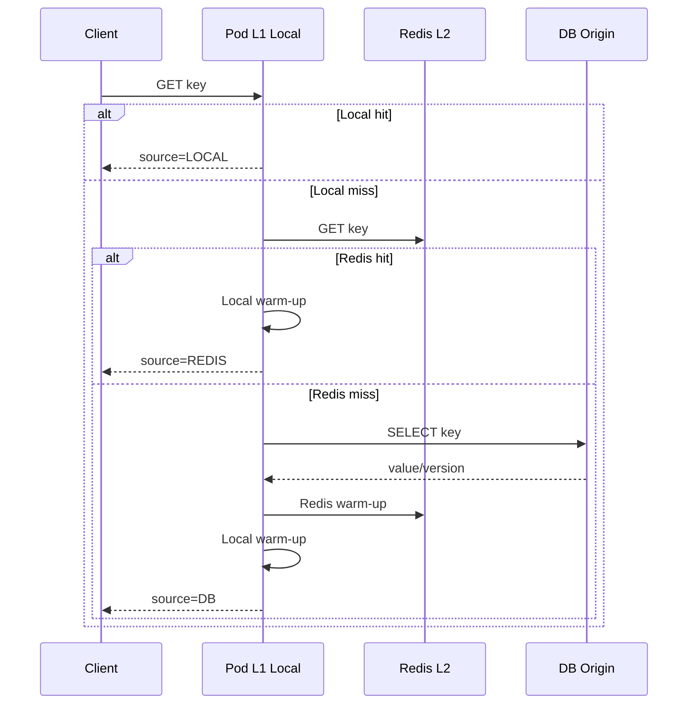
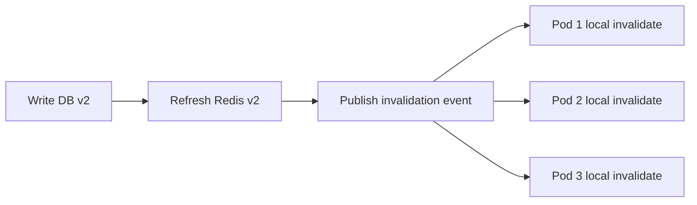

# 실무형 Cache Layer 패턴: Local Cache, Redis, DB

이 문서는 `com.vibewithcodex.study.cachetier` 패키지의 실습 코드를 기준으로, Caffeine Local Cache를 단독 사용법이 아니라 **실무 cache layer 설계** 관점에서 정리한다.

---

## 요약

- Local Cache는 가장 빠르지만 pod마다 독립적이어서 정합성과 warm-up 문제가 생긴다.
- Redis는 여러 pod가 공유하는 L2 캐시로, 수평 확장 환경에서 Local miss 비용을 줄인다.
- DB는 원천 저장소다. 캐시는 DB 부하를 줄이기 위한 복제본이며, 정합성 정책을 반드시 함께 설계해야 한다.
- 실무 기본형은 `Local Cache -> Redis -> DB`이고, 데이터 특성에 따라 `Local Cache -> Redis`, `Local Cache -> DB`를 선택할 수 있다.

---

## 1) 사용법

### 1-1. 실습 API

```http
POST /study/cachetier/db/product:100
Content-Type: application/json

{
  "value": "apple",
  "publishInvalidation": true
}
```

```http
GET /study/cachetier/LOCAL_REDIS_DB/pods/pod-1/data/product:100
```

응답의 핵심 필드는 다음과 같다.

| 필드 | 의미 |
| --- | --- |
| `source` | 최종 값을 반환한 계층: `LOCAL`, `REDIS`, `DB`, `MISS` |
| `scenario` | 사용한 계층 조합: `LOCAL_REDIS_DB`, `LOCAL_REDIS`, `LOCAL_DB` |
| `podId` | 어떤 pod의 Local Cache에서 조회했는지 |
| `version` | 원천/캐시 값의 버전. stale 여부 확인용 |
| `trace` | Local, Redis, DB를 어떤 순서로 확인했는지 |

### 1-2. 시나리오 선택 기준

| 시나리오 | 흐름 | 추천 상황 | 주의사항 |
| --- | --- | --- | --- |
| `LOCAL_REDIS_DB` | Local -> Redis -> DB | 일반적인 웹/커머스 조회, DB 보호 필요 | TTL, invalidation, stampede 방지 필요 |
| `LOCAL_REDIS` | Local -> Redis | 세션, feature flag, 외부에서 Redis가 채워지는 데이터 | Redis miss 시 DB fallback이 없으므로 적재 경로가 명확해야 함 |
| `LOCAL_DB` | Local -> DB | Redis를 두기 애매한 소규모/단순 read model | pod 수가 많아지면 DB miss 폭주 가능 |

---

## 2) 동작 방식

### 2-1. Local -> Redis -> DB



이 구조는 DB를 보호하면서도 hot key는 pod 내부에서 매우 빠르게 응답한다. 다만 Local Cache가 pod별로 독립이기 때문에, pod A에서 warm-up된 key가 pod B에는 없다.

### 2-2. Local -> Redis

Redis를 원천에 가까운 공유 캐시로 취급한다. 예를 들어 feature flag, banner config, session-like 데이터처럼 Redis에 채워지는 경로가 별도로 있을 때 유용하다.

Redis miss 시 DB를 조회하지 않는 것이 핵심이다. 실수로 DB fallback을 넣으면 “Redis-only 데이터”라는 설계 의도가 흐려지고 장애 범위도 달라진다.

### 2-3. Local -> DB

구조가 단순하고 운영 요소가 적다. 그러나 pod 수가 늘수록 각 pod가 independently warm-up되므로 DB 요청이 더 자주 발생한다.

소규모 서비스, read volume이 낮은 admin 데이터, Redis 운영 비용을 감수하기 어려운 경우에만 우선 검토한다.

---

## 3) 로컬 캐시를 효과적으로 처리하는 방식

### 3-1. TTL 계층화

| 계층 | 권장 방향 |
| --- | --- |
| Local Cache | 짧게 둔다. pod별 stale 노출 시간을 제한한다. |
| Redis | Local보다 길게 둔다. DB 보호와 pod 간 공유 효과를 맡긴다. |
| DB | 원천 저장소이며 TTL 개념이 아니라 트랜잭션/버전 관리 대상이다. |

### 3-2. Stampede 완화

동일 key가 동시에 Local miss가 되면 Redis/DB로 요청이 몰릴 수 있다. 실습 코드는 `podId:key` 단위 single-flight lock을 둬서 같은 pod 안의 같은 key miss를 한 번만 하위 계층으로 보낸다.

실무에서는 다음을 함께 검토한다.

| 방식 | 효과 |
| --- | --- |
| single-flight | 같은 key 동시 miss 중복 로딩 감소 |
| TTL jitter | 많은 key가 같은 시각에 만료되는 현상 완화 |
| pre-warm | 배포/기동 직후 cold start 완화 |
| negative caching | 없는 데이터 반복 조회의 DB 부하 완화 |
| refresh ahead | 만료 전에 백그라운드 refresh로 tail latency 완화 |

---

## 4) N개 pod에서 데이터 정합성 처리

### 4-1. 문제

Local Cache는 pod마다 메모리에 따로 있다. DB가 업데이트되어도 각 pod의 Local Cache는 자동으로 사라지지 않는다.



### 4-2. 기본 처리 순서

1. DB를 먼저 갱신한다.
2. Redis를 최신 값으로 갱신하거나 삭제한다.
3. invalidation event를 발행한다.
4. 각 pod는 해당 key의 Local Cache를 삭제한다.
5. 다음 조회에서 Redis 또는 DB를 통해 최신 값을 다시 warm-up한다.

### 4-3. 이벤트 유실/지연을 고려한 방어선

| 방어선 | 설명 |
| --- | --- |
| 짧은 Local TTL | 이벤트가 유실되어도 stale 지속 시간을 제한한다. |
| version 포함 | 응답/로그에서 구버전 값을 식별할 수 있다. |
| idempotent invalidate | 같은 이벤트가 여러 번 와도 안전해야 한다. |
| Redis version check | Local warm-up 시 구버전 Redis 값 적재를 피한다. |
| 모니터링 | hit ratio뿐 아니라 stale 의심 지표와 invalidation lag를 본다. |

실습 코드의 `publishInvalidation=false` 옵션은 이벤트 유실 상황을 재현한다. 이때 이미 warm-up된 pod는 TTL이 끝나기 전까지 구버전 값을 반환할 수 있다.

---

## 5) 내부 구현 관점

### 5-1. Caffeine Local Cache

Caffeine은 단순 Map이 아니라 eviction/expiration/admission 정책을 가진 고성능 local cache다. 실습 코드는 pod별로 Caffeine Cache 인스턴스를 만들고, `recordStats()`로 hit/miss/eviction을 확인한다.

이번 예제에서 중요한 Caffeine 포인트는 다음이다.

| 포인트 | 의미 |
| --- | --- |
| `maximumSize` | pod 메모리 보호 |
| custom expiry | entry별 만료 시각을 저장해 TTL/jitter를 표현 |
| `recordStats` | 운영 지표 확인 |
| pod별 인스턴스 | 다중 pod 환경에서 Local Cache가 공유되지 않음을 표현 |

### 5-2. Redis Mock

Redis mock은 TTL과 version을 함께 저장한다. 조회 시 만료 여부를 lazy하게 확인하고, 만료된 값은 제거한다.

실제 Redis라면 `GET`, `SET EX`, `DEL`, Pub/Sub 또는 Stream 기반 invalidation을 검토한다.

### 5-3. DB Mock

DB mock은 원천 저장소이며 쓰기마다 version을 증가시킨다. version은 Local Cache stale 여부를 테스트와 응답에서 확인하기 위한 최소 장치다.

---

## 유의사항

- cache hit ratio만 높다고 좋은 설계는 아니다. 오래된 값을 얼마나 허용할지 먼저 정해야 한다.
- Local Cache TTL을 너무 길게 두면 다중 pod 환경에서 stale 문제가 커진다.
- Redis TTL을 너무 짧게 두면 DB 보호 효과가 줄어든다.
- invalidation event는 유실, 중복, 지연을 전제로 설계해야 한다.
- Cache key에는 도메인, 식별자, 버전/테넌트 등 충돌 방지 정보가 포함되어야 한다.
